# Tree Diagram

```mermaid
flowchart TD
    START([START\nGood evening...]) --> A1_OPEN

    subgraph AXIS1["AXIS 1 — LOCUS: Victim ↔ Victor"]
        A1_OPEN{{"A1_OPEN\nWeather report?"}}
        A1_D1{A1_D1}
        A1_Q_AGENCY_HIGH{{"A1_Q_AGENCY_HIGH\nWhat made it go well?"}}
        A1_Q_AGENCY_LOW{{"A1_Q_AGENCY_LOW\nFirst instinct when hard?"}}
        A1_D2_HIGH{A1_D2_HIGH}
        A1_D2_LOW{A1_D2_LOW}
        A1_Q_CHOICE_STRONG{{"A1_Q_CHOICE_STRONG\nWhat deliberate choice?"}}
        A1_Q_CHOICE_WEAK{{"A1_Q_CHOICE_WEAK\nChoice you didn't see?"}}
        A1_D3{A1_D3\naxis1 dominant?}
        A1_R_INTERNAL[/"A1_R_INTERNAL\nYou stayed in the\ndriver's seat"/]
        A1_R_EXTERNAL[/"A1_R_EXTERNAL\nToday pulled your\nattention outward"/]
    end

    A1_OPEN --> A1_D1
    A1_D1 -->|Sunny/Cloudy| A1_Q_AGENCY_HIGH
    A1_D1 -->|Stormy/Foggy| A1_Q_AGENCY_LOW
    A1_Q_AGENCY_HIGH --> A1_D2_HIGH
    A1_D2_HIGH -->|prepared/adjusted| A1_Q_CHOICE_STRONG
    A1_D2_HIGH -->|team/lucky| A1_Q_CHOICE_WEAK
    A1_Q_AGENCY_LOW --> A1_D2_LOW
    A1_D2_LOW -->|figure out control| A1_Q_CHOICE_STRONG
    A1_D2_LOW -->|wait/stuck/push| A1_Q_CHOICE_WEAK
    A1_Q_CHOICE_STRONG --> A1_D3
    A1_Q_CHOICE_WEAK --> A1_D3
    A1_D3 -->|internal dominant| A1_R_INTERNAL
    A1_D3 -->|external dominant| A1_R_EXTERNAL

    A1_R_INTERNAL --> B12A([BRIDGE 1→2\nNow let's look at what you gave])
    A1_R_EXTERNAL --> B12B([BRIDGE 1→2\nNow let's look at what you gave])
    B12A --> A2_OPEN
    B12B --> A2_OPEN

    subgraph AXIS2["AXIS 2 — ORIENTATION: Entitlement ↔ Contribution"]
        A2_OPEN{{"A2_OPEN\nMoment that stood out?"}}
        A2_D1{A2_D1}
        A2_Q_CONTRIBUTION{{"A2_Q_CONTRIBUTION\nWhat was driving it?"}}
        A2_Q_ENTITLEMENT{{"A2_Q_ENTITLEMENT\nWhat were you expecting?"}}
        A2_D2_CONTRIBUTION{A2_D2_C}
        A2_D2_ENTITLEMENT{A2_D2_E}
        A2_Q_DISCRETIONARY{{"A2_Q_DISCRETIONARY\nSomething you chose not to give?"}}
        A2_Q_RECIPROCAL{{"A2_Q_RECIPROCAL\nWhat if you let it go?"}}
        A2_D3{A2_D3\naxis2 dominant?}
        A2_R_CONTRIBUTION[/"A2_R_CONTRIBUTION\nToday you gave more\nthan was asked"/]
        A2_R_ENTITLEMENT[/"A2_R_ENTITLEMENT\nWanting recognition\nisn't wrong but..."/]
    end

    A2_OPEN --> A2_D1
    A2_D1 -->|helped/extra| A2_Q_CONTRIBUTION
    A2_D1 -->|unseen/frustrated| A2_Q_ENTITLEMENT
    A2_Q_CONTRIBUTION --> A2_D2_CONTRIBUTION
    A2_D2_CONTRIBUTION -->|genuine/right thing| A2_Q_DISCRETIONARY
    A2_D2_CONTRIBUTION -->|hoped noticed| A2_Q_RECIPROCAL
    A2_Q_ENTITLEMENT --> A2_D2_ENTITLEMENT
    A2_D2_ENTITLEMENT -->|recognition/included| A2_Q_RECIPROCAL
    A2_D2_ENTITLEMENT -->|others' effort/fairness| A2_Q_DISCRETIONARY
    A2_Q_DISCRETIONARY --> A2_D3
    A2_Q_RECIPROCAL --> A2_D3
    A2_D3 -->|contribution dominant| A2_R_CONTRIBUTION
    A2_D3 -->|entitlement dominant| A2_R_ENTITLEMENT

    A2_R_CONTRIBUTION --> B23A([BRIDGE 2→3\nLet's zoom out — who else?])
    A2_R_ENTITLEMENT --> B23B([BRIDGE 2→3\nWho else was in the picture?])
    B23A --> A3_OPEN
    B23B --> A3_OPEN

    subgraph AXIS3["AXIS 3 — RADIUS: Self-Centric ↔ Altrocentric"]
        A3_OPEN{{"A3_OPEN\nWho comes to mind first?"}}
        A3_D1{A3_D1}
        A3_Q_SELF{{"A3_Q_SELF\nAnyone else affected?"}}
        A3_Q_TEAM{{"A3_Q_TEAM\nSpecific person you considered?"}}
        A3_Q_WIDE{{"A3_Q_WIDE\nWhat did awareness change?"}}
        A3_D2_S{A3_D2_S}
        A3_D2_T{A3_D2_T}
        A3_D2_W{A3_D2_W}
        A3_Q_EXPAND{{"A3_Q_EXPAND\nWhat would you want them to say?"}}
        A3_Q_MEANING{{"A3_Q_MEANING\nWho did you make better?"}}
        A3_D3{A3_D3\naxis3 dominant?}
        A3_R_ALTROCENTRIC[/"A3_R_ALTROCENTRIC\nYou moved beyond\nyour own frame"/]
        A3_R_SELF[/"A3_R_SELF\nFrame stayed close\ntoday"/]
    end

    A3_OPEN --> A3_D1
    A3_D1 -->|mostly me| A3_Q_SELF
    A3_D1 -->|my team| A3_Q_TEAM
    A3_D1 -->|colleague/customer| A3_Q_WIDE
    A3_Q_SELF --> A3_D2_S
    A3_D2_S -->|yes affected| A3_Q_EXPAND
    A3_D2_S -->|maybe/no| A3_Q_MEANING
    A3_Q_TEAM --> A3_D2_T
    A3_D2_T -->|yes noticed| A3_Q_EXPAND
    A3_D2_T -->|not really| A3_Q_MEANING
    A3_Q_WIDE --> A3_D2_W
    A3_D2_W -->|changed behavior| A3_Q_EXPAND
    A3_D2_W -->|didn't change much| A3_Q_MEANING
    A3_Q_EXPAND --> A3_D3
    A3_Q_MEANING --> A3_D3
    A3_D3 -->|altrocentric dominant| A3_R_ALTROCENTRIC
    A3_D3 -->|self dominant| A3_R_SELF

    A3_R_ALTROCENTRIC --> BSA([BRIDGE 3→SUMMARY])
    A3_R_SELF --> BSB([BRIDGE 3→SUMMARY])
    BSA --> SUMMARY
    BSB --> SUMMARY

    SUMMARY[["SUMMARY\nAxis 1: {dominant}\nAxis 2: {dominant}\nAxis 3: {dominant}\nSleep on this: {closing_question}"]]
    SUMMARY --> END([END\nSee you tomorrow.])

    style AXIS1 fill:#0e1a1f,stroke:#7eb8c9,color:#7eb8c9
    style AXIS2 fill:#0e1f10,stroke:#9ec49a,color:#9ec49a
    style AXIS3 fill:#1a0e1a,stroke:#c9a0b8,color:#c9a0b8
    style START fill:#1a1a0e,stroke:#c8a87a,color:#c8a87a
    style SUMMARY fill:#1a1a0e,stroke:#c8a87a,color:#c8a87a
    style END fill:#1a1a0e,stroke:#c8a87a,color:#c8a87a
```



## Path Count

With 2 branches at Axis 1's decision, 2 at Axis 2's, and 3 at Axis 3's entry (converging to 2), there are **16 unique conversation paths** through the tree, all producing the same node types but different questions, reflections, and closing questions.

## Signal Accumulation Logic

```
Each question node carries a signal tag:
  axis1:internal OR axis1:external
  axis2:contribution OR axis2:entitlement  
  axis3:altrocentric OR axis3:self

After each question, the tally updates:
  state.signals[axis][pole]++

At each DECISION_STATE node, dominant(axis) = argmax(state.signals[axis])
This routes to the appropriate reflection node.

At SUMMARY, the combination of three dominants selects the closing question
from a lookup table of 8 possible combinations.
```
